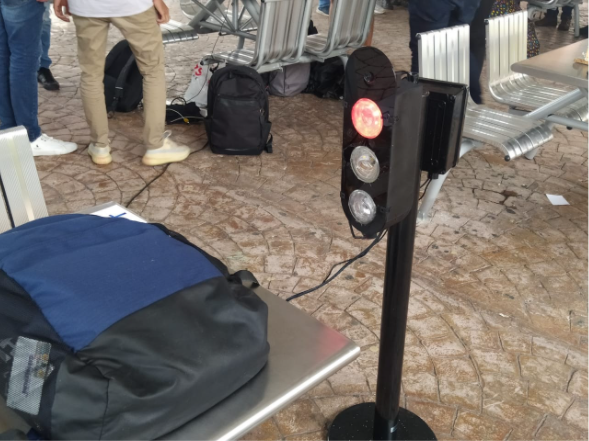

# ROAD-MOVEMENT

## Introducción

Armenia (Quindío) cuenta con semáforos que funcionan con temporizadores lo cual hace que en los lugares donde exista el semáforo no deje pasar los carros estando las vías peatonales y demás carreteras vacías para el libre tránsito del vehículo, debido a como se dijo anteriormente los semáforos están programados para variar entre sus luces por un tiempo lo que a veces genera una molestia en los conductores que les genera un retardo para llegar a sus destinos.  
El semáforo inteligente elaborado por MOVILIDAD- INTELIGENTE, se parte de la idea de que en la capital de Quindío actualmente no cuenta con la cantidad de semáforos inteligentes, lo que genera aglomeración de vehículos  innecesariamente en los semáforos a la espera de luz verde, para esto se toma la inteligencia artificial donde se procede hacer varios entrenamientos para el reconocimiento de vehículos, objetos y personas para este semáforo, con esta inteligencia artificial tomar decisiones con respecto al número de vehículos que se encuentren transitando por la carretera. el semáforo inteligente será capaz de  tomar  la decisión de asignar la luz adecuada del mismo para el entorno.

## Desarrollo

Anteriormente MOVILIDAD-INTELIGENTE elaboró una documentación donde se planteó el concebir y diseño del prototipo el cual compone en la identificación del problema cómo abordarlo junto con las herramientas y componentes electrónicos o no electrónicos que puedan llevar a la solución del problema. Para este episodio de MOVILIDAD-INTELIGENTE presenta la implementación y el operando de ROAD-MOVEMENT  (semáforo inteligente), para una mejor especificación y mejor entendimiento dividimos esto en varias etapas como se observa a continuación.

### 1. Etapa (Cambios de instrumentación)

Se elabora un estudio adicional sobre los componentes definidos los cuales ayudan a 	la implementación del prototipo donde ROAD-MOVEMENT hace un respectivo cambio en la cámara a utilizar, donde anteriormente se había definido Cámara Dahua Ref(DH-IPC-HFW1431S1-S4)  se cambió por una cámara Web para pc en 1080p donde en [1] cumple con las características adecuadas para este prototipo el cual y por el lado económico no se vio la necesidad de comprar una cámara con mucho más potencial para este primera versión del prototipo. el cual fue el único cambio que se realizó en el proyecto.

##### Figura 1: Cámara Dahua para el prototipo establecido imagen tomada de [Dahua-HFW1431S1-S4-CÁMARA-BULLET-IP-4MP-FICHA-TECNICA-ESPAÑOL.pdf]

##### Figura 2: Cámara Webcam logic  para el prototipo establecido imagen tomada de [Best five Webcam [1]]

### 2.Etapa (Pruebas)

Teniendo una vez las  tiras de luces led se empezó a enseñar estas misma para comprobar su correcto funcionamiento, después se implementó un circuito similar en protoboard en este caso con una raspberry pico que ambas tarjetas como la raspberry pi model b y la pico mandan un pulso en alto cuando se activa el pin, el cual este pulso llega a un transistor triac donde está conectado respectivamente a Ac enuna de sus patas el cual esto hace prender la tira led en este caso como se ve a continuación.

##### Figura 3 Prueba con el led y parte del circuito en protoboard.

Después de estas pruebas, se comienza a implementar la inteligencia artificial, con la ayuda de tensor flow el cual ya hay una red neuronal en estado de pre-entrenamiento en la identificación de objetos, el cual el equipo de MOVILIDAD-INTELIGENTE aborda la red neuronal pre estrenada él  reconocimiento de vehículos como (motocicletas,camiones,carros,buse y otros objetos.) el cual se termina de entrenar esta red neuronal para la detección de dichos objetos como se observa en la figura.

##### Figura 4 Prueba con la red neuronal.

Lo que equivale a que cuando la red neuronal esté entrenada este se suelta dos tipos de archivos donde uno de ellos estan todas la etiquetas de las cosas que va identificar la inteligencia artificial, esto se sube a la raspberry pi donde esté conectada con la cámara comenzará a identificar los objetos, cuando detecte los tipos de vehículos como carros camiones busetas motocicletas y ciclas, con esta información se empieza a elaborar la toma de decisiones, donde el equipo de trabajo concluyó que cuando no hay carros el semáforo esté en rojo, y cuando haya un número de aglomeración de vehículos deje pasar los vehículos, el cual esto en la raspberry mandar un pulso en alto al circuito y con y este ejecuta y encenderá el led adecuado en el momento.

### 3. Etapa (Placa).

##### Figura 5 Circuito de potencia.

##### Figura 6 Placa del Circuito de potencia(Parte delantera).

##### Figura 7 Placa del Circuito de potencia(Parte trasera). 

Esta placa se manda a diseñar el cual esta conlleva su caminos para  Dc y AC en la parte trasera se ven los buses que muestran los caminos del DC y en la parte delantera se ven los buses que lleva la parte AC. dicho funcionamiento de esta placa se describe en la documentación final de CDIO  donde en resumidas cuentas los pines denominados como “y” “g” y “r” manda una señal de voltaje en dc activados por la inteligencia artificial que está subida a la raspberry el cual esta señal llega a unos optoacopladores (elementos blancos) donde esto hace activar internamente un diodo el cual comunica un puente para que se comunique así toda la señal hasta llegar a un triac(últimos elementos de la PCB) donde con la señal que entró en la base al triac hace que se active el circuito dejan pasar la señal Ac que viene conectada a una de las patas y asi esta señal deja pasar la señal ya en Ac para alimentar los bombillos que se ven al final y así activarlas.

##### Figura 5 Placa física del Circuito de potencia.

### 4.Etapa (conexiones entre raspberry y placa)

Después de tener las pruebas de la inteligencia artificial, y la pruebas de la placa conectada con las luces led, se conectan estos dos módulos, donde la entrada Dc que tiene la placa son las entradas de los pines de la raspberry pi donde se conecta con los respectivos pines.

##### Figura 6 Pines Placa Y R G.

En estos pines se conecta los pines de la raspberry el cual la Y(Pin que va conectado para activar el led amarillo)  R(Pin que va conectado para activar el led rojo) G(Pin que va conectado para activar el led verde) los demas pines son de alimentación, lo que equivale que cuando la camara detecte un fujo de carros mayor este lo estara leyendo la rapsberry pi y con la logica implementada en la inteligencia artificial ese enviara un pulso en alto por el respectivo pin de la placa donde este se comunicara con los demas elemento electronicos de la placa y alli se encendera el led correspondiente a la logica y decision que tomo el software al pasarlo por todo el hardware. con todo esto conectado seguimos a la siguiente y última etapa.

### 5.Etapa (Implementación del semáforo).

El equipo de trabajo manda a diseñar una caja cuadrada en acrílico donde allí se guardará el circuito implementado, donde fuera de ello se elaboró la caja que contiene las tres luces del semáforo inteligente, donde las luces led se enrollan en un recipiente redondo donde su parte delantera está cubierta por un plástico transparente para dar la apariencia de un semáforo común, por último se utiliza una base donde soportará el semáforo junto con el circuito dando como resultado el prototipo de la figura 7.

##### Figura 7 Prototipo del semáforo en funcionamiento.

## Video producto final en acción

[Video semáforo en acción.](https://www.youtube.com/watch?v=Il2ijxcZqFI)
